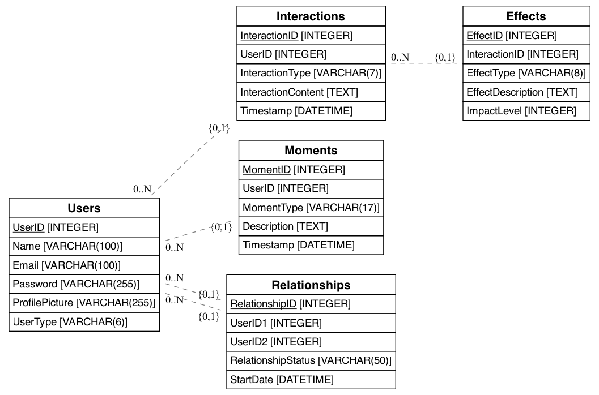

# The Emotional AI Project
Developmental Project by MO Cavada
## Overview

The "Emotional AI" project aims to create a comprehensive platform for introspection and emotional analysis. The project is structured to serve multiple purposes, including acting as an API server, providing an admin UI for data management and analysis, and planning for future expansion to include a cross-platform mobile version for public users.

* Admin Prototype: - [Dataset Procssing and Analysis for Conext Embedding and Relevant Testing from AI Models](https://www.kentoverse.com)
* Chat Prototype: - [Cross-platform App using Expo (React-Native)](https://www.botski.info)
* Working Case Studies: - [Research](https://medium.com/@motato_42768/e-a-i-24014e13a592)
  

## Emotional AI Book and The 3 Constants of Human Connection

Authored by Botski, the soon-to-be-published book “Emotional AI” explores human connections through the dual lenses of artificial intelligence and introspection. Drawing from transformative moments in his life, Botski identifies patterns that, when connected, form a coherent framework that can be processed through a single system. For instance, questions about a relationship’s past interactions can be passed through an algorithm to produce insightful answers. He hypothesizes that this framework, combined with inherent human attributes or constants, can address the increasing disconnections in human bonding. Having experienced this crisis himself, Botski is now dedicated to improving relationships by helping individuals reconnect with their innate ability to balance emotions, leading to clarity of mind, self-awareness, broader insights, and deeper introspection. His explorative work has culminated in a theory, “The 3 Constants of Human Connection,” which forms the basis of the book and outlines the fundamental elements governing human interactions and relationships.
=======
InspectorRAGet has been developed as a [React](https://react.dev/) web application built with [NextJS 14](https://nextjs.org/) framework and the [Carbon Design System](https://carbondesignsystem.com/).

## 🎥 Demo
[](https://www.youtube.com/watch?v=vB7mJnSNx7s)

## 🏗️ Build & Deploy

To install and run InspectorRAGet follow the steps below:

### Installation
We use yarn as a default package manager. 
>>>>>>> 77570c32a327737b82b66cb783a9bdf3df9a7e30

The book premise aligns with the goal to create an introspective guide and integrated with AI's latest capabilities to support users in understanding and improving their connections.

**Important Note: Emotional AI stands for Emotional Authentic Intelligence. We are not building an AI that mimics human emotions, which is impossible. Instead, our focus is on creating tools that help users introspect and understand their own emotions and interactions authentically.**

These 3 constants are:

1. **Change (Moment of Interaction)**: This constant highlights the dynamic nature of relationships, emphasizing the importance of actions (Act), reactions (React), and attractions (Attract) in shaping human connections.

2. **Power (Influence and Effect from Interactions)**: This constant delves into the forms of power that influence relationships, including negative/destructive power, positive/creative power, and neutral/equilibrium. Understanding these forces helps in navigating the complexities of emotional interactions.

<<<<<<< HEAD
3. **Moments (Timeline Connections of Influence and Effect)**: This constant focuses on the temporal aspects of relationships, stressing the significance of past reflections, future insights, and present awareness. By introspecting on these moments, individuals can gain deeper insights into their interactions and connections.


## Purpose and Alignment to Technology

To create an app that guides users through introspection using “The 3 Constants of Human Connection.” This app will teach users how to understand their interactions, the influences of these interactions, and the underlying causes rooted in our past and present experiences can define potential outcomes in our future.

 ### Reflection App, the following design patterns would align most closely:

	1.	In-context Learning – Since the app provides personalized reflections based on user inputs, AI-generated content, and spiritual insights, this aligns with in-context learning. The model adapts to the user’s input to provide emotionally attuned and spiritually relevant guidance, akin to personalized AI responses.

	2.	Data Preprocessing / Embedding – The Reflection App likely uses data preprocessing to convert user inputs into a form that can be embedded for further processing by the AI model. This embedding allows the app to analyze the emotional and spiritual content of journaling entries, enhancing the personalized nature of the insights.

	3.	Prompt Construction / Retrieval – In generating AI-powered reflections and insights, the app would involve constructing prompts based on user data and retrieving relevant Bible verses or spiritual content. The alignment with Sentiment Analysis also suggests that the prompts are crafted to be contextually relevant to the user’s emotional state.

	4.	Prompt Execution / Inference – The AI model (e.g., ChatGPT or other language models) takes the constructed prompts and executes them to generate personalized insights. This is core to delivering reflections based on the user’s journaling and ensuring that they are emotionally and spiritually attuned.

## The Introspection Process

1. **Analyze the Interplay of Interactions**: This step focuses on understanding the initial interactions that stem from our inherent need to connect with others.
2. **Visualize the Effect of Interactions**: This step examines the effects that attract and influence future interactions based on our initial connections.
3. **Understand the Connection between Interactions and Past**: This step delves into how past experiences and memories influence our current interactions and connections.

## Application of Emotional AI

The AI component of the app will assist users in:

- **Analyzing their interactions (Act, React, Attract)**
- **Visualizing the influences of these interactions (Negative, Positive, Balanced)**
- **Understanding on past experiences, forecasting future outcomes, and maintaining present awareness**

The book premise aligns with our goal to create an introspective guide and incorporate Emotional AI to support users in understanding and improving their connections that foster healthier and meaningful relationships.

## Introspection Algorithms

OpenAI can be used to implement and enhance the introspection algorithm by referring to the 3 Constants of Human Connections. Here’s how it can be done:

### 1. Change – Dynamics of Interaction

**Algorithm Explanation**:

- **Act**: Identify and analyze initial interactions, such as changing the topic in a conversation.
- **React**: Understand and interpret responses to these actions, determining how they ignite subsequent interactions.
- **Attract**: Analyze what aspects of the interaction attract and maintain engagement.

**Implementation with OpenAI**:

- **Act**: Use the model to parse user inputs and detect initial actions.
- **React**: Generate possible reactions and interpret the sentiment and context of these reactions.
- **Attract**: Identify key elements that drive engagement or attraction within the interaction.

### 2. Power – Attraction of Influence and Effect it Causes

**Algorithm Explanation**:

- **Negative Effects**: Detect and categorize interactions leading to negative outcomes.
- **Positive Effects**: Identify interactions resulting in positive engagement and reinforcement.
- **No Effect/Balance**: Recognize neutral interactions that maintain a state of equanimity.

**Implementation with OpenAI**:

- Analyze interactions to classify them into negative, positive, or neutral categories.
- Provide insights or feedback based on the classified interaction types to help users understand their impact.

### 3. Moments – Connecting Experiences in a Timeline

**Algorithm Explanation**:

- **Past Reflections**: Encourage users to reflect on past experiences and how they influence current interactions.
- **Future Insights**: Provide predictions or insights into potential future outcomes based on current patterns.
- **Present Awareness**: Enhance present-moment awareness and mindfulness in interactions.

**Implementation with OpenAI**:

- Generate prompts and questions that guide users in reflecting on past experiences.
- Use predictive models to offer insights into possible future scenarios based on current behavior patterns.
- Enhance real-time feedback to promote present-moment awareness during interactions.

## Integrating OpenAI with Introspection Algorithm

1. **Input Parsing**: OpenAI can process and understand user inputs, identifying key elements of the interaction.
2. **Contextual Understanding**: The model can maintain context over a conversation, providing relevant and consistent feedback.
3. **Response Generation**: Based on the 3 Constants, OpenAI can generate responses that guide users through introspection, offering personalized insights and feedback.

## Example Workflow

1. **User Input**: The user describes an interaction or reflects on a past experience.
2. **Analysis**:
   - **Change**: The model analyzes the dynamics of the interaction (Act, React, Attract).
   - **Power**: It classifies the effects of the interaction (negative, positive, neutral).
   - **Moments**: It helps the user connect the interaction to past experiences, present awareness, and future possibilities.
3. **Output**: The model generates an introspective response, helping the user understand their actions and emotions better.

By combining IBM InspectorRAGet for robust data analysis and OpenAI for dynamic user interaction and introspection, we aim to create a powerful and comprehensive Emotional AI platform that provides meaningful insights and guidance to users. This is a possibility we are soon to explore. We hope to learn how to synergize the strengths of both platforms, utilizing them to their fullest potential and addressing any issues that arise.


## Why We Are Using IBM InspectorRAGet as Our Base for Building Our Own AI Data Model

IBM InspectorRAGet provides a robust foundation for building sophisticated AI models. It offers:

1. **Proven Framework**: A reliable and tested framework that ensures stability and performance.
2. **Advanced Metrics**: Comprehensive metrics for performance benchmarking and analysis.
3. **Scalability**: Built to handle large-scale data, making it suitable for extensive AI applications.
4. **Integration Capabilities**: Easy integration with various tools and platforms, including those provided by OpenAI.
5. **Community Support**: Strong support from the IBM community and continuous updates.

### Integrating OpenAI with IBM InspectorRAGet

1. **Complementary Functions**:
   - **IBM InspectorRAGet**: Focuses on performance benchmarking, aggregate and instance-level analysis, and providing a holistic view of results via metrics, annotator qualification, and dataset characterization.
   - **OpenAI**: Enhances introspection capabilities by analyzing interactions, generating personalized insights, and maintaining contextual understanding over conversations.

2. **Seamless Integration**:
   - OpenAI’s models can process data provided by IBM InspectorRAGet, ensuring a continuous flow of information and insights.
   - The structured data and metrics from InspectorRAGet can inform and improve the responses generated by OpenAI, ensuring they are accurate and relevant.

3. **Enhanced Capabilities**:
   - Using both tools together leverages the strengths of each, providing a more comprehensive AI solution.
   - InspectorRAGet handles the backend data analysis, while OpenAI focuses on front-end user interactions and introspection, ensuring a seamless user experience.

By combining IBM InspectorRAGet for robust data analysis and OpenAI for dynamic user interaction and introspection, you can create a powerful and comprehensive Emotional AI platform that provides meaningful insights and guidance to users. This synergy ensures that the strengths of both platforms are utilized to their fullest potential, without conflict.

For more information, refer to the [IBM InspectorRAGet documentation](https://www.ibm.com/docs/en).

# Emotional AI and Introspection App Integration

## 1. User Interaction and Data Collection

### Chatbot and Conversation Interface (OpenAI GPT-3/4)

- **User Inputs**: Use OpenAI’s GPT-3/4 to manage user interactions through chat. This can include handling user queries, providing conversational responses, and engaging in empathetic dialogue.
- **Journaling and Logging**: Enable users to write journal entries or log their moods using natural language inputs. GPT-3/4 can help make this process smoother by suggesting prompts and assisting with text entry.

## 2. Emotion and Sentiment Analysis

### Analysis with IBM InspectorRAGet

- **Text Analysis**: Once user inputs are collected, send the text data to IBM InspectorRAGet for detailed sentiment and emotion analysis. This tool can provide insights into the user’s emotional state by analyzing the language used.
- **Real-Time Feedback**: Implement real-time analysis where user inputs are immediately processed by IBM InspectorRAGet to provide instant feedback or suggestions based on the detected emotions.

## 3. Integration Workflow

### Step-by-Step Process

1. **User Interaction**:
   - Users interact with the app via chat or journaling features powered by GPT-3/4.
   - GPT-3/4 handles the conversation flow and assists users in expressing their thoughts and emotions.
2. **Data Transfer**:
   - User-generated text is sent to IBM InspectorRAGet for emotion and sentiment analysis.
   - InspectorRAGet processes the text and returns a detailed emotional analysis.
3. **Emotional Insights**:
   - The emotional analysis from InspectorRAGet is integrated back into the app.
   - Insights are displayed to the user, providing a summary of their emotional state and any identified patterns.
4. **Personalized Responses**:
   - Based on the emotional insights, GPT-3/4 generates personalized responses, suggestions, and content recommendations.
   - The app can suggest activities, articles, or coping strategies tailored to the user’s current emotional state.

## 4. Personalized Content Recommendations

- **Content Delivery**: Use the emotional analysis to tailor content recommendations. If InspectorRAGet detects stress, GPT-3/4 can suggest relaxation techniques, mindfulness exercises, or supportive articles.
- **Adaptive Learning**: Continuously refine content suggestions based on user feedback and ongoing emotional analysis.

## 5. Visualization and Reporting

- **Emotional Insights Dashboard**: Create visual reports and dashboards that display the emotional analysis over time. Users can track their emotional journey and identify patterns or triggers.
- **Progress Tracking**: Allow users to see how their emotional health evolves, with insights generated by IBM InspectorRAGet and narrative summaries by GPT-3/4.

## 6. Backend Integration

- **Data Pipeline**: Establish a secure and efficient data pipeline to transfer user inputs from the frontend (GPT-3/4) to the backend (InspectorRAGet) for analysis.
- **Scalability**: Ensure the system can handle large volumes of data and provide real-time analysis and feedback.

## 7. Security and Privacy

- **Data Encryption**: Implement robust encryption methods to protect user data during transmission and storage.
- **User Consent**: Ensure users are informed about how their data will be used and obtain their consent for emotional analysis.

## Technical Implementation

```python
import openai
import ibm_inspector_raget

# Initialize OpenAI GPT-3/4
openai.api_key = 'your_openai_api_key'

# Function to handle user input and generate response
def handle_user_input(user_input):
    # Generate response using GPT-3/4
    gpt_response = openai.Completion.create(
        engine="davinci",
        prompt=user_input,
        max_tokens=150
    )
    return gpt_response.choices[0].text.strip()

# Function to analyze emotion using IBM InspectorRAGet
def analyze_emotion(text):
    emotion_analysis = ibm_inspector_raget.analyze_text(text)
    return emotion_analysis

# Main interaction function
def main():
    user_input = input("Enter your thoughts: ")
    gpt_response = handle_user_input(user_input)
    emotion_analysis = analyze_emotion(user_input)
    
    print("GPT-3/4 Response:", gpt_response)
    print("Emotion Analysis:", emotion_analysis)

if __name__ == "__main__":
    main()
=======
##  Usage

Once you have started InspectorRAGet, the next step is import a json file with the evaluation results in the format expected by the platform. You can do this in two ways:
- Use one of our [integration notebooks](#use-inspectorraget-through-integration-notebooks), showing how to use InspectorRAGet in combination with popular evaluation frameworks.
- Manually convert the evaluation results into the expected format by consulting the [documentation of InspectorRAGet's file format](#use-inspectorraget-by-manually-creating-input-file).

## Use InspectorRAGet through integration notebooks

To make it easier to get started, we have created notebooks showcasing how InspectorRAGet can be used in combination with popular evaluation frameworks. Each notebook demonstrates how to use the corresponding framework to run an evaluation experiment and transform its output to the input format expected by InspectorRAGet for analysis. We provide notebooks demonstrating integrations of InspectorRAGet with the following popular frameworks:

| Framework | Description | Integration Notebook |
| --- | --- | --- |
| Language Model Evaluation Harness | Popular evaluation framework used to evaluate language models on different tasks | [LM_Eval_Demonstration.ipynb](notebooks/LM_Eval_Demonstration.ipynb) |
| Ragas | Popular evaluation framework specifically designed for the evaluation of RAG systems through LLM-as-a-judge techniques | [Ragas_Demonstration.ipynb](notebooks/Ragas_Demonstration.ipynb) |
| HuggingFace | Offers libraries and assets (incl. datasets, models, and metric evaluators) that can be used to both create and evaluate RAG systems | [HuggingFace_Demonstration.ipynb](notebooks/HuggingFace_Demonstration.ipynb) |

## Use InspectorRAGet by manually creating input file

If you want to use your own code/framework, not covered by the integration notebooks above, to run the evaluation, you can manually transform the evaluation results to the input format expected by InspectorRAGet, described below. Examples of input files in the expected format can be found in the [data](data) folder.  

The experiment results json file expected by InspectorRAGet can be broadly split into six sections along their functional boundaries. The first section captures general details about the experiment in `name`, `description` and `timestamp` fields. The second and third sections describe the
sets of models and metrics used in the experiment via the `models` and `metrics` fields, respectively. The last three sections cover the dataset and the outcome of evaluation experiment in the form of `documents`, `tasks` and `evaluations` fields.

#### 1. Metadata

```json
{
    "name": "Sample experiment name",
    "description": "Sample example description",
    ...
```

#### 2. Models

```json
    "models": [
      {
        "model_id": "model_1",
        "name": "Model 1",
        "owner": "Model 1 owner",
      },
      {
        "model_id": "model_2",
        "name": "Model 2",
        "owner": "Model 2 owner",
      }
    ],
```

Notes: 

1. Each model must have a unique `model_id` and `name`. 

#### 3. Metrics

```json
      "numerical": [
            {
            "name": "metric_a",
            "display_name": "Metric A",
            "description": "Metric A description",
            "author": "algorithm | human",
            "type": "numerical",
            "aggregator": "average",
            "range": [0, 1, 0.1]
            },
            {
            "name": "metric_b",
            "display_name": "Metric B",
            "description": "Metric B description",
            "author": "algorithm | human",
            "type": "categorical",
            "aggregator": "majority | average",
            "values": [
                  {
                        "value": "value_a",
                        "display_value": "A",
                        "numeric_value": 1
                  },
                  {
                        "value": "value_b",
                        "display_value": "B",
                        "numeric_value": 0
                  }
                ]
            },
            {
            "name": "metric_c",
            "display_name": "Metric C",
            "description": "Metric C description",
            "author": "algorithm | human",
            "type": "text"
            }
      ],
```
Notes:

1. Each metric must have a unique name.
2. Metric can be of `numerical`, `categorical`, or `text` type. 
3. Numerical type metrics must specify `range` field in `[start, end, bin_size]` format. 
4. Categoricl type metrics must specify `values` field where each value must have `value` and `numerical_value` fields.
5. Text type metric are only accesible in instance level view and not used in any experiment level aggregate statistics and visual elements.

#### 4. Documents

```json
      "documents": [
            {
                  "document_id": "GUID 1",
                  "text": "document text 1",
                  "title": "document title 1"
            },
            {
                  "document_id": "GUID 2",
                  "text": "document text 2",
                  "title": "document title 2"
            },
            {
                  "document_id": "GUID 3",
                  "text": "document text 3",
                  "title": "document title 3"
            }
      ],
```
Notes:

1. Each document must have a unique `document_id` field.
2. Each document must have a `text` field.

#### 5. Tasks

```json
      "filters": ["category"],
      "tasks": [
            {
                  "task_id": "task_1",
                  "task_type": "rag",
                  "category": "grounded",
                  "input": [
                        {
                              "speaker": "user",
                              "text": "Sample user query"
                        }
                  ],
                  "contexts": [
                        {
                              "document_id": "GUID 1"
                        }
                  ],
                  "targets": [
                        {
                              "text": "Sample response"
                        }
                  ]
            },
            {
                  "task_id": "task_2",
                  "task_type": "rag",
                  "category": "random",
                  "input": [
                        {
                              "speaker": "user", 
                              "text": "Hello"
                        }
                  ],
                  "contexts": [
                        {
                              "document_id": "GUID 2"
                        }
                  ],
                  "targets": [
                        {
                              "text": "How can I help you?"
                        }
                  ]
            }
      ],
```
Notes: 

1. Each task must have a unique `task_id`.
2. Task type can be of `question_answering`, `conversation`, or of `rag` type.
3. `input` is an array of utterances. An utterance's speaker could be either `user` or `agent`. Each utterance must have a `text` field.
4. `contexts` field represents a subset of documents from the `documents` field relevant to the `input` and is available to the generative models. 
5. `targets` field is an array of expected gold or reference texts. 
6. `category` is an optional field that represents the type of task for grouping similar tasks.
7. `filters` is a top-level field (parallel to `tasks`) which specifies an array of fields defined inside `tasks` for filtering tasks during analysis. 

#### 6. Evaluations

```json
"evaluations": [
      {
            "task_id": "task_1 | task_2",
            "model_id": "model_1 | model_2",
            "model_response": "Model response",
            "annotations": {
                  "metric_a": {
                        "system": {
                              "value": 0.233766233766233
                        }
                  },
                  "metric_b": {
                        "system": {
                              "value": "value_a | value_b"
                        }
                  },
                  "metric_c": {
                        "system": {
                              "value": "text"
                        }
                  },
            }
      }
]
```
Notes:

1. `evaluations` field must contain evaluation for every model defined in `models` section and on every task in `tasks` section. Thus, total number of evaluations is equal to number of models (M) X number of tasks (T) = M X T
2. Each evaluation must be associated with single task and single model.
3. Each evaluation must have model prediction on a task captured in the `model_response` field. 
4. `annotations` field captures ratings on the model for a given task and for every metric specified in the `metrics` field.
5. Each metric annotation is a dictionary containing worker ids as keys. In the example above, `system` is a worker id. 
6. Annotation from any worker on all metrics must be in the form of a dictionary. At minimum, such dictionary contains `value` key capturing model's rating for the metric by the worker. 

## Citation
If you use InspectorRAGet in your research, please cite our paper:
>>>>>>> 77570c32a327737b82b66cb783a9bdf3df9a7e30

```
## Benefits

- **Separation of Concerns:** Keeping the admin UI and the public-facing UI separate allows for tailored interfaces for each audience without unnecessary complexity.
- **Scalability:** The backend API can serve multiple clients (admin UI, public web app, mobile app), making the architecture scalable.
- **Flexibility:** Different UI libraries can be used for different parts of the project, providing flexibility in tool choice.
- **Maintainability:** Separation of the admin and public interfaces makes the codebase easier to maintain and update.


## Entities and Relationships

### 1. Users: Stores user information.
- **UserID** (Primary Key)
- **Name**
- **Email**
- **Password**
- **ProfilePicture**
- **UserType** (Owner/Walker)

### 2. Interactions: Records the interactions between users.
- **InteractionID** (Primary Key)
- **UserID** (Foreign Key to Users)
- **InteractionType** (Act, React, Attract)
- **InteractionContent**
- **Timestamp**

### 3. Effects: Logs the effects of each interaction.
- **EffectID** (Primary Key)
- **InteractionID** (Foreign Key to Interactions)
- **EffectType** (Negative, Positive, Neutral)
- **EffectDescription**
- **ImpactLevel**

### 4. Moments: Captures reflections, insights, and present awareness.
- **MomentID** (Primary Key)
- **UserID** (Foreign Key to Users)
- **MomentType** (Past Reflection, Future Insight, Present Awareness)
- **Description**
- **Timestamp**

### 5. Relationships: Stores connections between users.
- **RelationshipID** (Primary Key)
- **UserID1** (Foreign Key to Users)
- **UserID2** (Foreign Key to Users)
- **RelationshipStatus**
- **StartDate**

## Entity Relationship Diagram (ERD)

- **Users (1) to Interactions (N)**: A user can have multiple interactions.
- **Interactions (1) to Effects (1)**: Each interaction has one effect.
- **Users (1) to Moments (N)**: A user can have multiple moments.
- **Users (1) to Relationships (N)** with themselves through UserID1 and UserID2: A user can have multiple relationships with other users.

## SQL Schema Example

```sql
CREATE TABLE Users (
    UserID INT PRIMARY KEY AUTO_INCREMENT,
    Name VARCHAR(100) NOT NULL,
    Email VARCHAR(100) NOT NULL UNIQUE,
    Password VARCHAR(255) NOT NULL,
    ProfilePicture VARCHAR(255),
    UserType ENUM('Owner', 'Walker') NOT NULL
);

CREATE TABLE Interactions (
    InteractionID INT PRIMARY KEY AUTO_INCREMENT,
    UserID INT,
    InteractionType ENUM('Act​⬤


```

## Steps to Generate an Generate an Entity Relationship Diagram (ERD) Diagram Locally

### 1. Install Required Libraries
Ensure you have Python installed, and then install the necessary libraries:
```bash
pip install sqlalchemy eralchemy

### 2. Create a Python Script : Save the following code into a Python file, e.g., generate_erd.py:


from sqlalchemy import create_engine, Column, Integer, String, Enum, ForeignKey, Text, DateTime
from sqlalchemy.ext.declarative import declarative_base
from sqlalchemy.orm import relationship
from eralchemy import render_er

Base = declarative_base()

class User(Base):
    __tablename__ = 'Users'
    UserID = Column(Integer, primary_key=True, autoincrement=True)
    Name = Column(String(100), nullable=False)
    Email = Column(String(100), nullable=False, unique=True)
    Password = Column(String(255), nullable=False)
    ProfilePicture = Column(String(255))
    UserType = Column(Enum('Owner', 'Walker'), nullable=False)

class Interaction(Base):
    __tablename__ = 'Interactions'
    InteractionID = Column(Integer, primary_key=True, autoincrement=True)
    UserID = Column(Integer, ForeignKey('Users.UserID'))
    InteractionType = Column(Enum('Act', 'React', 'Attract'), nullable=False)
    InteractionContent = Column(Text, nullable=False)
    Timestamp = Column(DateTime, nullable=False)
    user = relationship("User", back_populates="interactions")

class Effect(Base):
    __tablename__ = 'Effects'
    EffectID = Column(Integer, primary_key=True, autoincrement=True)
    InteractionID = Column(Integer, ForeignKey('Interactions.InteractionID'))
    EffectType = Column(Enum('Negative', 'Positive', 'Neutral'), nullable=False)
    EffectDescription = Column(Text, nullable=False)
    ImpactLevel = Column(Integer, nullable=False)
    interaction = relationship("Interaction", back_populates="effects")

class Moment(Base):
    __tablename__ = 'Moments'
    MomentID = Column(Integer, primary_key=True, autoincrement=True)
    UserID = Column(Integer, ForeignKey('Users.UserID'))
    MomentType = Column(Enum('Past Reflection', 'Future Insight', 'Present Awareness'), nullable=False)
    Description = Column(Text, nullable=False)
    Timestamp = Column(DateTime, nullable=False)
    user = relationship("User", back_populates="moments")

class Relationship(Base):
    __tablename__ = 'Relationships'
    RelationshipID = Column(Integer, primary_key=True, autoincrement=True)
    UserID1 = Column(Integer, ForeignKey('Users.UserID'))
    UserID2 = Column(Integer, ForeignKey('Users.UserID'))
    RelationshipStatus = Column(String(50), nullable=False)
    StartDate = Column(DateTime, nullable=False)
    user1 = relationship("User", foreign_keys=[UserID1])
    user2 = relationship("User", foreign_keys=[UserID2])

User.interactions = relationship("Interaction", order_by=Interaction.InteractionID, back_populates="user")
User.moments = relationship("Moment", order_by=Moment.MomentID, back_populates="user")
Interaction.effects = relationship("Effect", order_by=Effect.EffectID, back_populates="interaction")

# Creating the SQLite engine
engine = create_engine('sqlite:///:memory:')
Base.metadata.create_all(engine)

# Generating the ER diagram
render_er(Base, 'ERD_diagram.png')

# Generating the ER diagram
render_er(Base, 'ERD_diagram.png')

### 3. Run the Script, Execute the script to generate the ERD diagram

```python generate_erd.py


This markdown text provides a comprehensive guide for setting up and generating an ERD diagram locally using Python and the required libraries.


###4 # Steps to Generate an ERD Diagram Locally

## 1. Install Required Libraries
Ensure you have Python installed, and then install the necessary libraries:
```bash
pip install sqlalchemy eralchemy

## Documentation

### Entity Relationship Diagram (ERD)




## Project Structure

### Current Components

1. **API Server and Admin UI:**

### API Server 
- The current `emotional AI` app serves as the backend API server, providing endpoints for data management, user authentication, and other necessary backend services.
### Admin UI

- This application includes an admin UI for managing and analyzing data, built using the `@carbon/themes` library.
-  Build the admin interface using `@carbon/themes` within the same application.
- Implement features for data management and analysis accessible only to authorized admin users.


### Directory Structure

```plaintext
emotional-AI/
├── backend/
│   ├── app.py
│   ├── requirements.txt
│   ├── Dockerfile
│   └── ...
├── admin-ui/
│   ├── src/
│   ├── public/
│   ├── package.json
│   ├── Dockerfile
│   └── ...
├── public-web-app/
│   ├── src/
│   ├── public/
i;'/
veloper.mozilla.org/en-US/docs/Web/API/Web_components)
- Anothe option to consider is the Micro Frontend Architecture with Module Federation to manage dependencies. 

### 2. Mobile App (User)
   - A cross-platform mobile app will be developed using frameworks such as React Native or Flutter, ensuring optimized mobile experiences for public users.

* Test UI Prototype: - [IntroSpirit](https://www.botski.info)


### Simplified Explanation: In-Context Learning

**In-context learning** is a method for using large language models (LLMs), like GPT-4, without needing to fine-tune or retrain them. Instead of modifying the model itself, we control its behavior by giving it specific "context" through prompts. This makes it easy to use while keeping the process efficient.

### Example of In-Context Learning:
Imagine you’re building a chatbot to answer questions about legal documents. A simple approach might be to paste all the documents into the prompt and then ask a question. While this could work for small documents, it doesn't work well when you have a large dataset. For instance, GPT-4 has a limit on how much text it can process at once (about 50 pages). If you exceed that, the model performs worse and takes longer.

**In-context learning** fixes this by sending only the most relevant documents to the LLM, instead of dumping everything. The LLM then uses those relevant documents to answer the question effectively.

### How It Works:
1. **Data Preparation/Embedding**: 
   - First, your documents (like legal files) are broken into chunks and processed into a format the model can understand, called "embeddings."
   - These chunks are stored in a special database, called a **vector database**, which is designed to find and retrieve similar or relevant documents quickly.

2. **Prompt Construction/Retrieval**:
   - When the user asks a question (like a legal query), the system finds the most relevant chunks of text from the vector database.
   - A prompt is then created by combining a pre-defined template, some example outputs, and the relevant documents.

3. **Prompt Execution**:
   - This constructed prompt is sent to the LLM (such as GPT-4), which processes the information and gives an answer. Developers often include extra features like logging (keeping track of requests) and caching (saving previous results to avoid reprocessing) to make this step more efficient.

### Why Is This Useful?
- **No Need for Fine-Tuning**: Instead of retraining the LLM on new data (which can be costly and time-consuming), you only need to manage the data and how it's fed into the model.
- **Cost-Effective**: Training an LLM requires significant computing power, but with in-context learning, you're simply working with prompts and databases, which most companies already know how to handle.

### Common Questions:
- **Can we just increase the model’s context window (its ability to process more text at once)?**
   - While possible, it gets expensive very quickly. For example, asking GPT-4 a question over 10,000 pages could cost hundreds of dollars, making it impractical for most use cases.

In summary, **in-context learning** is a clever and efficient way to use LLMs by focusing on managing data and prompts, rather than training or modifying the models themselves.